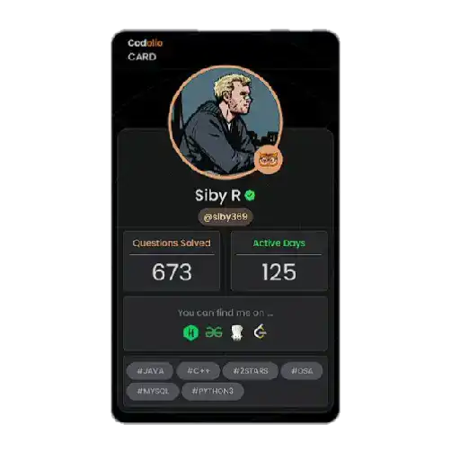

  

<picture>
  <source media="(prefers-color-scheme: dark)" srcset="./Skills_Animation_Dark.gif">
  <source media="(prefers-color-scheme: light)" srcset="./Skills_Animation_White.gif">
  
</picture>
 

  
  
  

  

I am an aspiring Full-Stack Developer with a strong interest in building scalable web applications and solving complex problems through efficient code. My current focus is on advancing my expertise in the MERN Stack (MongoDB, React, Node.js) and deepening my knowledge of Data Structures & Algorithms (DSA) to strengthen problem-solving skills.

I enjoy exploring new technologies, working on practical projects, and continuously refining my development abilities. My goal is to evolve into a versatile software engineer capable of contributing to impactful and innovative solutions.

### What I’m Currently Focusing On  

  
-   
  Mastering **MongoDB, React, and Node.js**  

-   
  Practicing **Data Structures & Algorithms**  

-   
  Improving **problem-solving and coding efficiency**

### My Approach

  I like to think of myself as someone who works smarter, not harder.

<h3 style="margin: 0;">
  My LeetCode Stats
<picture>
&nbsp;&nbsp;&nbsp;&nbsp;&nbsp;&nbsp;&nbsp;&nbsp;&nbsp;&nbsp;&nbsp;&nbsp;&nbsp;&nbsp;&nbsp;&nbsp;&nbsp;&nbsp;&nbsp;&nbsp;&nbsp;&nbsp;&nbsp;&nbsp;&nbsp;&nbsp;&nbsp;&nbsp;&nbsp;&nbsp;&nbsp;&nbsp;&nbsp;&nbsp;&nbsp;&nbsp;&nbsp;&nbsp;&nbsp;&nbsp;&nbsp;&nbsp;&nbsp;&nbsp;&nbsp;&nbsp;&nbsp;&nbsp;&nbsp;&nbsp;&nbsp;&nbsp;&nbsp;&nbsp;&nbsp;&nbsp;&nbsp;&nbsp;&nbsp;&nbsp;&nbsp;&nbsp;&nbsp;&nbsp;&nbsp;&nbsp;&nbsp;&nbsp;&nbsp;&nbsp;&nbsp;&nbsp;&nbsp;&nbsp;&nbsp;&nbsp;&nbsp;&nbsp;&nbsp;&nbsp;&nbsp;&nbsp;&nbsp;&nbsp;&nbsp;&nbsp;&nbsp;&nbsp;&nbsp;&nbsp;&nbsp;&nbsp;&nbsp;&nbsp;&nbsp;&nbsp;&nbsp;&nbsp;&nbsp;&nbsp;&nbsp;&nbsp;&nbsp;My Codolio card
  
</h3>
  

